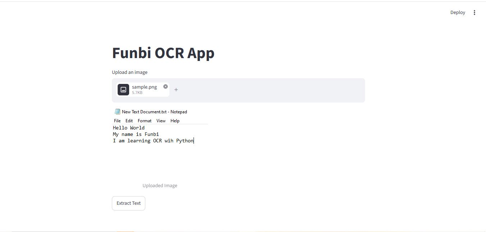
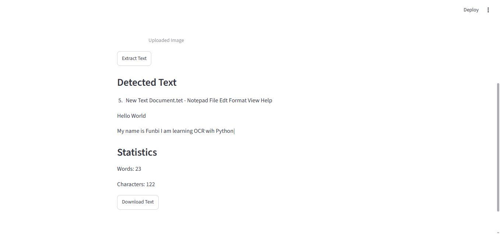

# Funbi OCR App

## Overview

Funbi OCR App is a web-based Optical Character Recognition (OCR) application built with Python, Streamlit, and Tesseract OCR.

The application allows users to upload images containing text, extract the text automatically, view OCR results instantly, analyze text statistics, and download the extracted content as a text file.

---

## Features

✅ Upload PNG, JPG, and JPEG images

✅ Extract text from images using Tesseract OCR

✅ Preview uploaded images

✅ Display detected text instantly

✅ Generate word count statistics

✅ Generate character count statistics

✅ Download extracted text as a TXT file

✅ Interactive web interface built with Streamlit

---

## Technologies Used

- Python
- Streamlit
- Tesseract OCR
- PyTesseract
- Pillow

---

## Application Screenshots

### Home Page


---

### Image Upload



---

### OCR Result and Statistics



---

## Project Workflow

1. User uploads an image.
2. Image is processed using Pillow.
3. Tesseract OCR extracts text from the image.
4. Extracted text is displayed on the screen.
5. Word and character statistics are generated.
6. User can download the extracted text file.

---

## Installation

Clone the repository:

```bash
git clone https://github.com/Funbi-data/ocr-text-recognition-project.git
```

Move into the project directory:

```bash
cd ocr-text-recognition-project
```

Install dependencies:

```bash
pip install streamlit pytesseract pillow
```

Install Tesseract OCR:

Windows:

```text
https://github.com/UB-Mannheim/tesseract/wiki
```

Update the Tesseract path inside the application if needed:

```python
pytesseract.pytesseract.tesseract_cmd = r"C:\Program Files\Tesseract-OCR\tesseract.exe"
```

Run the application:

```bash
streamlit run app.py
```

---

## Sample OCR Output

Input Image:

```text
Hello World
My name is Funbi
I am learning OCR with Python
```

Extracted Output:

```text
Hello World
My name is Funbi
I am learning OCR with Python
```

---

## Future Improvements

- PDF OCR Support
- Multiple Image Upload
- OCR Confidence Scores
- Text Translation
- AI-Powered Summarization
- Cloud Deployment

---

## Author

### Funbi Opemipo Olowojesiku

Aspiring AI Engineer | Data Analyst | Machine Learning Enthusiast

GitHub:
https://github.com/Funbi-data

LinkedIn:
https://www.linkedin.com/in/funbiolowojesiku

## License

This project is open-source and available under the MIT License.
